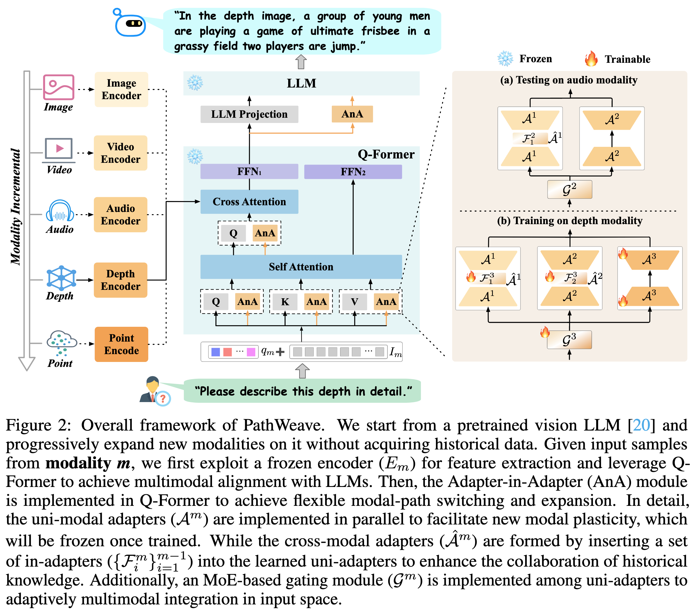

# PathWeave
Code for paper "[LLMs Can Evolve Continually on Modality for **X**-Modal Reasoning](https://arxiv.org/pdf/2410.20178)" NeurIPS2024🎉

## Table of Contents
  - [Abstract](#Abstract)
  - [Approach](#Approach)
  - [Getting Started](#Getting-started)
    - [Data Processing(depth)](#Data-Processing(depth))
    - [Model ckpt](#Model-ckpt)
    - [Test](#Test)
    - [Train](#Train)
  - [Citation](#Citation)
  - [Acknowledgement](#Acknowledgement)

___
- [X] Train&Test
- [X] Data Processing
- [X] Checkpoints
## Abstract
Multimodal Large Language Models (MLLMs) have gained significant attention due to their impressive capabilities in multimodal understanding. However, existing methods rely heavily on extensive modal-specific pretraining and joint-modal tuning, leading to significant computational burdens when expanding to new modalities. In this paper, we propose **PathWeave**, a flexible and scalable framework with modal-path switching and expansion abilities that enables MLLMs to continually evolve on modalities for X-modal reasoning. We leverage the concept of Continual Learning and develop an incremental training strategy atop pre-trained MLLMs, enabling their expansion to new modalities using uni-modal data, without executing joint-modal pretraining. In detail, a novel Adapter-in-Adapter (AnA) framework is introduced, in which uni-modal and cross-modal adapters are seamlessly integrated to facilitate efficient modality alignment and collaboration. Additionally, an MoE-based gating module is applied between two types of adapters to further enhance the multimodal interaction. To investigate the proposed method, we establish a challenging benchmark called Continual Learning of Modality (MCL), which consists of high-quality QA data from five distinct modalities: image, video, \textcolor{black}{audio, depth} and point cloud. Extensive experiments demonstrate the effectiveness of the proposed AnA framework on learning plasticity and memory stability during continual learning. Furthermore, PathWeave performs comparably to state-of-the-art MLLMs while concurrently reducing parameter training burdens by 98.73\%.

## Approach
___


## Getting Started
### Data Processing

Our depth data are generated follow the instruction of [OneLLM](https://github.com/csuhan/OneLLM/blob/main/docs/Data.md).

- Step 1: Download CC3M data based on this json file (the entire data requires too much disk space).

    - LLaVA:

        training_data: [llava_instruct_50k_train_data.json](https://drive.google.com/drive/folders/1a5E4DBzTtq8cKr8oGLQUtWLwc2caVX4c?usp=drive_link)

        val_data: [llava_instruct_1dot5k_test_data_coco.json](https://drive.google.com/drive/folders/1a5E4DBzTtq8cKr8oGLQUtWLwc2caVX4c?usp=drive_link)

    - CC3M:

        training_data: [CC3M_train_50k_clear_depth_complete.json](https://drive.google.com/drive/folders/1a5E4DBzTtq8cKr8oGLQUtWLwc2caVX4c?usp=drive_link)

        val_data: [CC3M_val_1_5k_coco.json](https://drive.google.com/drive/folders/1a5E4DBzTtq8cKr8oGLQUtWLwc2caVX4c?usp=drive_link)

    - Fusion (CC3M + LlaVA): It is recommended to prioritize the use of this data, as data mixing has already been completed.

        traning_data: [fusion_train_55w_clear.json](https://drive.google.com/drive/folders/1a5E4DBzTtq8cKr8oGLQUtWLwc2caVX4c?usp=drive_link)

- Step 2: Follow the installation guidance of [DPT](https://github.com/EPFL-VILAB/omnidata/tree/main/omnidata_tools/torch#run-our-models-on-your-own-image)

- Step 3: Generate depth data using the following scripts or DIY.

    Training_data: Run the script ```bash run_scripts/data_processing/depth_generation_1.sh ```

    val_data: Run the script ```bash run_scripts/data_processing/depth_generation_val_cc3m.sh ```


### Model-ckpt
[Google Drive](https://drive.google.com/drive/folders/1a5E4DBzTtq8cKr8oGLQUtWLwc2caVX4c?usp=drive_link)
### Test
Example:

Run the script ```bash run_scripts/ours/video/test_video_modality.sh ```
### Train
Example:

Run the script ```bash run_scripts/ours/video/train_video_modality.sh ```

- _Note: Need to load the parameters of previous modality for current training._
## Citation
```
@article{yu2024llms,
  title={LLMs Can Evolve Continually on Modality for X-Modal Reasoning},
  author={Yu, Jiazuo and Xiong, Haomiao and Zhang, Lu and Diao, Haiwen and Zhuge, Yunzhi and Hong, Lanqing and Wang, Dong and Lu, Huchuan and He, You and Chen, Long},
  journal={arXiv preprint arXiv:2410.20178},
  year={2024}
}
```
## Acknowledgement
Our repo is built on [X-InstructBLIP](https://github.com/salesforce/LAVIS/tree/main/projects/xinstructblip) and [OneLLM](https://github.com/csuhan/OneLLM/tree/main).  We thank the authors for sharing their codes.


